# Childhood Memories - Back End

> **Childhood Memories** is a social-media website designed to mimic the features of Twitter. Users can create an account, log in, make a post, make comments on posts, like other users' posts and comments, and change their profile photo and profile biography. This website is designed to allow users to make posts about whatever they want but my objective is to recall our 90's childhood when there was no candy crush, whatsapp and twitter. This repository contains the back end API portion of **Childhood Memories**, created with Django REST Framework.

## Deployed Link

- [Childhood Memories Back End Deployed Link](https://childhood-memories.herokuapp.com/)

## Front-End Links

- [Childhood Memories Front-End Deployed Link]()
- [Childhood Memories Front-End GitHub]()

## Table of Contents

- [Childhood Memories - Back End](#childhood-memories---back-end)
  - [Deployed Link](#deployed-link)
  - [Front-End Links](#front-end-links)
  - [Table of Contents](#table-of-contents)
  - [User Experience (UX)](#user-experience-ux)
    - [Project Structure](#project-structure)
    - [User Stories](#user-stories)
    - [Database Model](#database-model)
  - [Technologies Used](#technologies-used)
    - [Programs Used](#programs-used)
  - [Testing](#testing)
    - [Validation Testing](#validation-testing)
    - [Manual Testing](#manual-testing)
    - [Bugs](#bugs)
  - [Deployment](#deployment)
  - [Credits](#credits)
    - [Code](#code)
    - [Acknowledgement](#acknowledgement)

---

## User Experience (UX)

### Project Structure

The overall structure of the project was modelled from from the [drf-api](https://github.com/Code-Institute-Solutions/drf-api) walktrhough. This is to be expected since the walkthrough follows an insdustry standard way of implementing an API. In addition, the strucutre of the serializer, model, and url files are also adapted from the walkthrough since this is the "pythonic" way of implementing an API using the Django REST framework.

### User Stories

- Authentication

  1. As a **user** I **cannot edit/delete posts/comments/likes that are not mine** so that **I can be assured that my posts/comments/likes are protected and can only be changed by me.**

     - This user story is achieved by creating custom permissions that will stop users from deleting, editing, unliking/liking posts/comments that are not done by themselves.

  2. As a **user** I can **see whether I am logged in or not** so that **I will know if I will need to log in if I am not.**

     - This user story is achieved by showing the username created in Profile after the user signs up and logs in using Django's all-auth.

  3. As a **user** I can **sign up easily with just a username and password** so that **I have the ability to create posts or comments without having to share my email address.**

     - This user story is achieved by using Django's all-auth.

  4. As a **user** I can **easily log out** so that **I can have more security on my account.**

     - This user story is achieved by using Django's all-auth.

  5. As a **user** I can **easily log in** so that **I can quickly post, add more comments, or delete content if I wish.**

     - This user story is achieved by using Django's all-auth.

  6. As a **user** I can **only like/unlike other users' posts and comments** so that **I can only show my appreciation for other posts/comments and not cheat the system by liking my own posts/comments.**

     - This user story is achieved by creating the Comment Likes and Post Likes models to like other user's content. Custom permissions are created to allow users to only like other users' posts/comments.

  7. As a **user** I can **only follow other users** so that **I cannot cheat the system and follow myself and gain myself a new, false follower.**

     - This user story is achieved by creating the Follower model to follow other users. A custom permission is created to stop users from following themselves.

- Posts

  1. As a **user** I can **create new posts** so that **I can share images, my memories, my experience.**

     - This user story is achieved by creating the Post model. Users can add images, content, category and a title to posts.

  2. As a **user** I can **edit posts** so that **I can change my posts, images, etc whenever I change my mind about what I posted or wish to remove/add details.**

     - This user story is achieved by using generics. RetrieveUpdateDestroyAPIView in Post views. Users are able to edit their posts.

  3. As a **user** I can **delete my posts** so that **I can get rid of my posts that I no longer want to be shared.**

     - This user story is achieved by using generics. RetrieveUpdateDestroyAPIView in Post views. Users are able to delete their posts.

  4. As a **user** I can **view the details of a post** so that **I can read more information about the post such as when it was created, who created it, if it was edited, read the comments, etc.**

     - This user story is achieved by using generics. RetrieveUpdateDestroyAPIView in Post views. Users are able to see the detailed information about a post such as who created it, when it was created/edited, if there are comments, etc.

  5. As a **user** I can **like posts** so that **I can share my appreciation for the post and show the world and the author that their post is great.**

     - This user story is achieved using the Post likes model. Users are able to like to user posts.

  6. As a **user** I can **remove likes on a post** so that **I can change my mind about whether I like the post or not.**

     - This user story is achieved using generics. RetrieveDestroyAPIView in Post Like views. Users are able to remove their likes on a post.

- Comments

  1. As a **user** I can **post a comment on a post** so that **I can contribute discussion to a post or share my thoughts about a post.**

     - This user story is achieved using the Comment model. Users are able to add comments on posts.

  2. As a **user** I can **delete my comments on a post** so that **I can remove comments if I no longer want my comments to be public.**

     - This user story is achieved using generics. RetrieveUpdateDestroyAPIView in Comment views. Users are able to delete their comments.

  3. As a **user** I can **read comments on a post** so that **I can read what others think about the post and read the discussion happening.**

     - This user story is achieved using generics. ListCreateAPIView in Comment views. Users are able to read the list of comments on a post.

  4. As a **user** I can **edit my comments** so that **have the possibility to remove or add more details to my existing comments.**

     - This user story is achieved using generics.RetrieveUpdateDestroyAPIView in Comment views. Users are able to edit their comments.

  5. As a **user** I can **like comments** so that **I can share my appreciation for the comment.**

     - This user story is achieved by creating the Comment Likes model. Users are able to like to other users' comments.

  6. As a **user** I can **unlike comments** so that **I can change my mind about my positive feelings towards a comment.**

     - This user story is achieved using generics. RetrieveDestroyAPIView in Comment Likes views. Users are able to remove their likes on a post.

- Profile

  1. As a **user** I can **follow or unfollow other users** so that **I can see or choose to remove posts by specific users in my posts feed.**

     - This user story is achieved using the Follower model. Users are able to follow and unfollow other users.

  2. As a **user** I can **view a detailed page of users** so that **I can see their posts and learn more about the user. I can also see their following count, followers count, etc.**

     - This user story is achieved using the Profile views. Users are able to see posts tied to a user, including their following count and followers count.

  3. As a **user** I can **view user avatars** so that **easily identify users of the website.**

     - This user story is achieved by the Profile model, allowing users to view profile images/avatars of other users.

- Errors

  1. As a **user** I can **view a nice 500 page in the API** so that **I can be informed whether the server or database is having an issue on a nice, user-friendly interface.**

     - This user story is achieved by creating custom views to throw a 500 page in a readable format when the server or database is having an issue.

  2. As a **user** I can **see a nice 404 page in the API** so that **I know if I have reached a webpage that does not exist on a more user-friendly interface.**

     - This user story is achieved by creating custom views to throw a 404 page in a readable format when a link or page does not exist.

- Searching

  1. As a **user** I can **search for posts or users by typing in text in the search bar** so that **I can easily find posts or users with a few keyboard taps.**

     - This user story is achieved in Post views where custom filterset fields, search fields, and ordering fields are implemented to allow users to search for posts based on content, title, and author.

- Filtering

  1. As a **user** I can **easily filter information based on different circumstances** so that **I can easily find information via a simple filtering method such as who is following who, what posts a user liked, etc.**

     - This user story is achieved by creating custom filterset fields in Post views, Comment views, Profile views, etc. However, users will not be able to see who is following who, they can see how many followers a user has or how many they are following.

### Database Model

- Database model has been created using Lucid Chart.

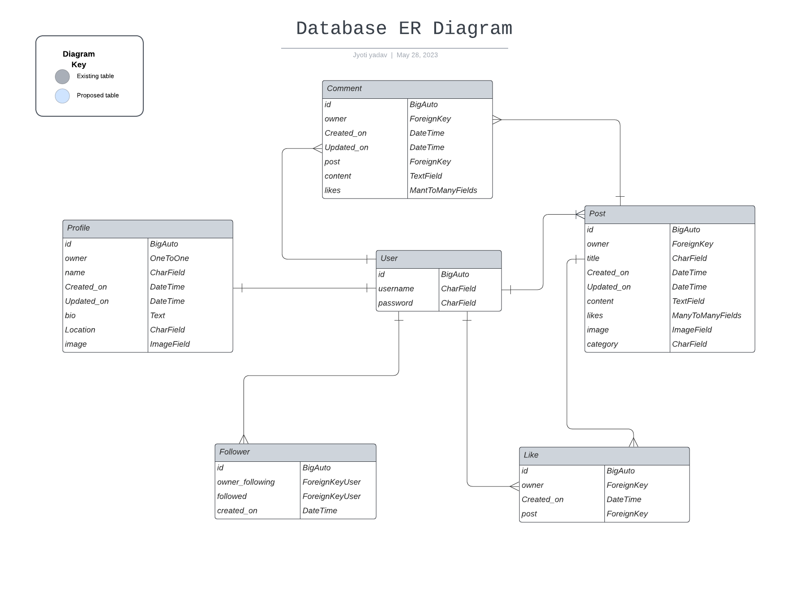

## Technologies Used

1. [Django REST Framework](https://pypi.org/project/djangorestframework/3.14.0/)

2. [Django](https://www.djangoproject.com/)

3. [Python](https://www.python.org/)

4. [psycopg2](https://pypi.org/project/psycopg2/)

5. [Django all-auth](https://django-allauth.readthedocs.io/en/latest/installation.html)

6. [gunicorn](https://gunicorn.org/)

7. [PostgreSQL](https://www.postgresql.org/)

8. [dj-rest-auth](https://pypi.org/project/dj-rest-auth/2.2.5/)

9. [Django-filter](https://pypi.org/project/django-filter/22.1/)

10. [Djangorestframework-simplejwt](https://pypi.org/project/djangorestframework-simplejwt/5.2.1/)

11. [Django-cors-headers](https://pypi.org/project/django-cors-headers/3.13.0/)

### Programs Used

1. [Git](https://git-scm.com/)

   - Git was used by utilizing the Gitpod terminal to commit to Git and Push to GitHub. Version control.

2. [GitHub](https://github.com/)

   - GitHub was used to store the project code after being pushed in by Git. Project repository linked with Heroku for the deployment process. GitHub was also used to create the kanban board.

3. [Heroku](https://dashboard.heroku.com/login)

   - Heroku was used to deploy this project.

4. [Whimsical](https://whimsical.com)

   - Whimsical was used to create the data model for the back end.

5. [CI Python Linter](https://pep8ci.herokuapp.com/)

   - CI Python Linter was used to validate the Python code used and check for warnings/errors.

6. [Cloudinary](https://cloudinary.com/)

   - Cloudinary is used to host the uploaded images.

7. [Autopep8](https://pypi.org/project/autopep8/)

   - Autopep8 was used to help organize Python code to match PEP8 standards.

8. Beautify

   - Beautify Command Palette on Git was used to organize the code in all files.

9. [ElephantSQL](https://www.elephantsql.com/)

   - ElephantSQL was used for the configured and optimized PostgreSQL database.

10. [Pillow](https://pypi.org/project/Pillow/9.2.0/)
    - Python Imaging Library which provides image processing capabilities.

## Testing

### Validation Testing

- All files (except env.py and settings.py) have been run through CI Python Linter and all files returned no issues.

### Manual Testing

- Thorough lists of tests have been done on the back end project. These are lists of successful results after vigorous manual testing.
  Testing was done manually by trying each list over and over to ensure success. I have tested each list over and over again to ensure that everything is working perfectly.

1. Profile:

   - Users are able to successfully create an account and their profile, default image, and content are saved in the database.
   - Users are able to view their username, image, content, when their account was created, etc.
   - The post count, following count, and follower count are visible in the user API. When creating new posts, following new users or being followed, the numbers will go up, and will decrease when there are any deletions or unfollows.
   - A List of users are shown in the list view, and a detailed list of users will show with the approrpriate id.
   - User can view other's profile but can edit their own profile.
   - Users are able to be deleted in the back end.
   - All urls are working perfectly. Can view all profiles when visiting `/profiles/`. Can access specific profiles in detail view when adding specific profile id to url.

   

    
Screenshot of Profile List

    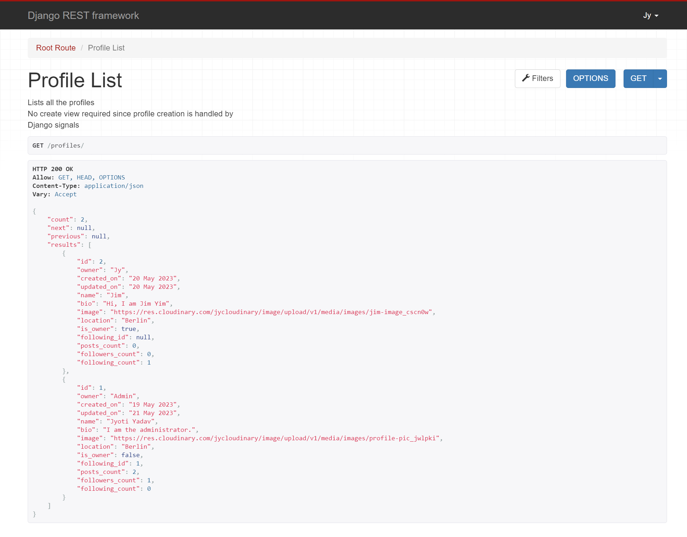
    

   

    
Screenshot of owner's profile details with edit functionality

    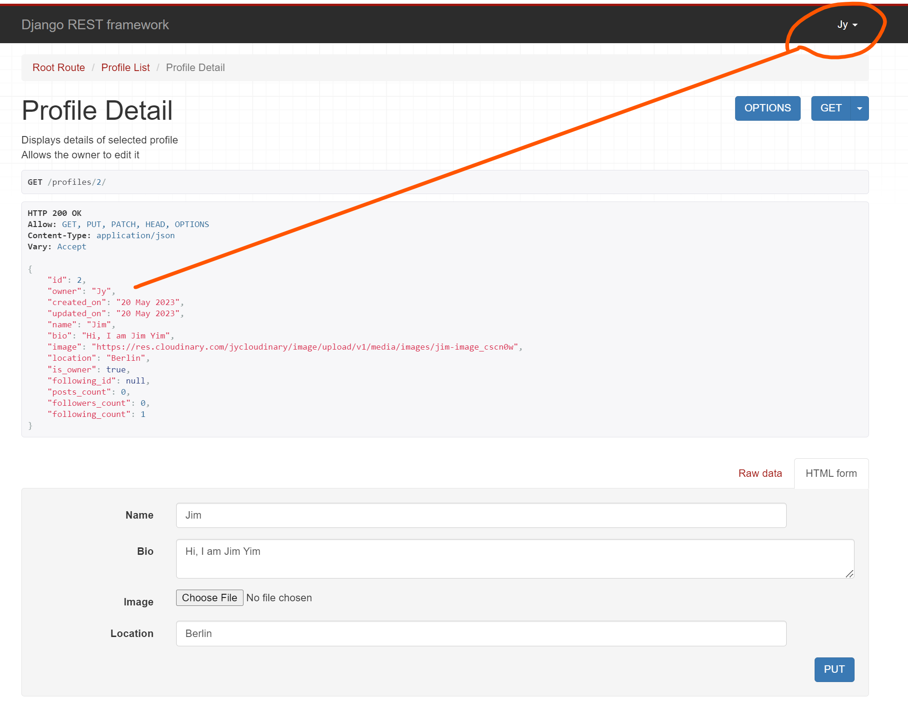
    

   

    
Screenshot of other's profile details which is readonly 

    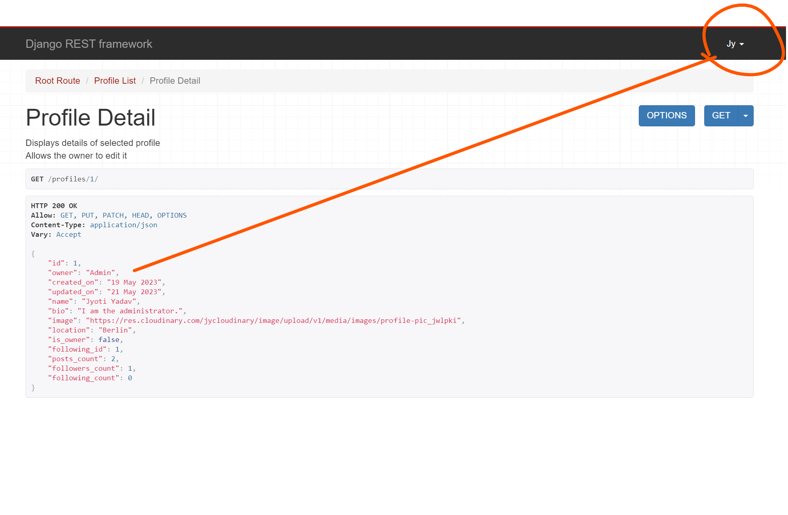
    

2. Post:

   - Users are able to successfully create posts and have the posts attached to the user id.
   - The number of posts tied to a user will increase or decrease if the user posts more or deletes posts.
   - API shows whether the logged-in user is the author of the post or not.
   - The posts successfully show the author, when it was created, when it was updated, the post image, the content, and title.
   - Posts are successfully able to be edited and deleted ONLY by the author of the post.
   - Image validation created in the serializer.py works as images posted by the user must be less than 2 MG, smaller than 4096 px in width and in height.
   - The list of posts appear in the list view page, and a detailed view of posts will appear in the detail view page with the appropriate post id.
   - Posts are successfully able to be searched by typing author, title, and content.
   - Posts are successfully able to be filtered by user feed, user-liked posts, and user posts.
   - Posts are successfully able to be ordered based on number of likes, the number of comments, and when the post like was created at.
   - Posts are able to be liked and unliked, and have the number of likes edited accurately.
   - All urls are working perfectly. Can view all posts when visiting `/posts/`. Can access specific posts in detail view when adding specific post id to url.

   

Screenshot of Posts List 

    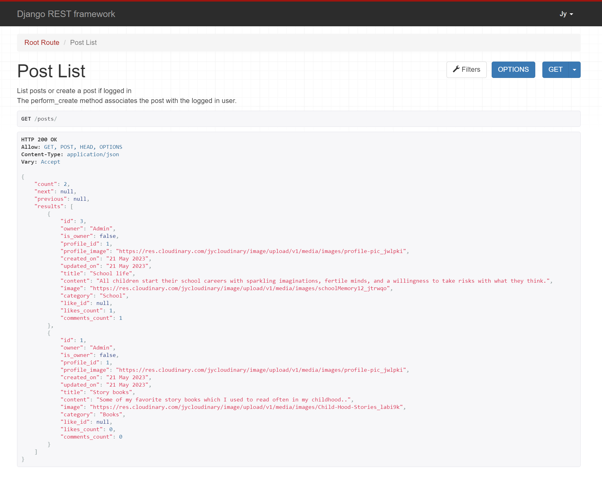
    

    

   
Screenshot of post detail with invalid Id 

    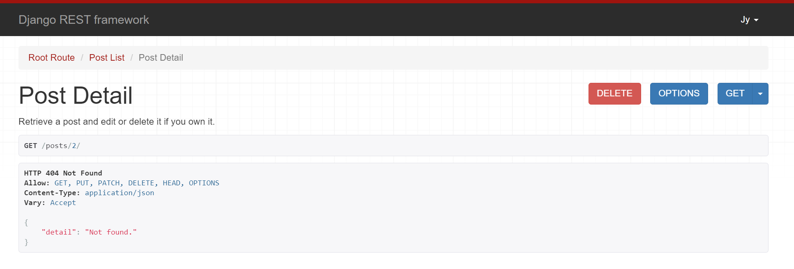
    

3. Comment:

   - Users are able to successfully create comments and have the comments attached to the user id and post id.
   - The number of comments will increase or decrease if the user chooses to delete or remove the comment.
   - API shows whether the logged-in user is the commenter of the comment or not.
   - The comments successfully show the commenter, when it was created, when it was updated, and the content.
   - Comments are successfully able to be edited and deleted ONLY by the commenter of the post.
   - The list of comments appear in the list view page, and a detailed view of comments will appear in the detail view page with the appropriate comment id.
   - Comments associated with a given post are successfully able to be retrieved.
   - Comments are successfully able to be ordered based on number of likes and when the comment like was created at.
   - Comments are able to be liked and unliked, and have the number of likes changed accurately.
   - All urls are working perfectly. Can view all comments when visiting `/comments/`. Can access specific comments in detail view when adding specific comment id to url.

    

Screenshot of Comment List 

     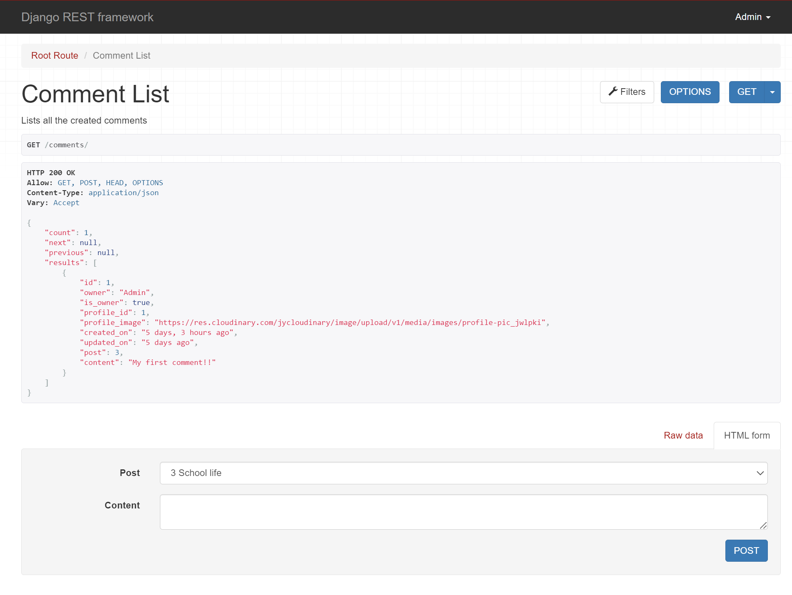
     

    

Screenshot of Comment Detail using its 'id'

    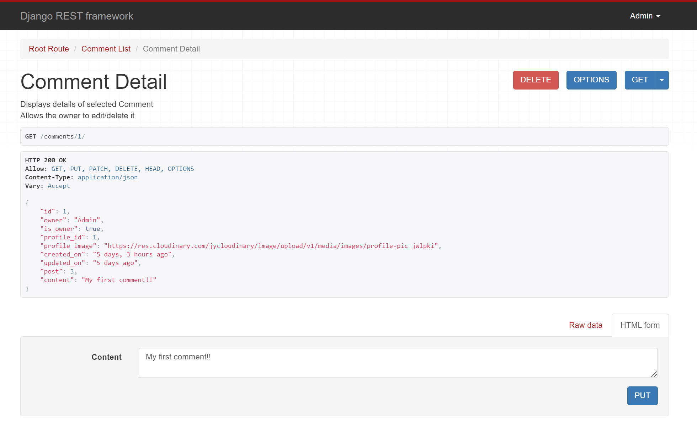
    

4. Follower:

   - Users are successfully able to follow other users. API successfully reads which user is the follower, and which user is being followed.
   - The creation date of the follow is successfully logged with the number of days shown.
   - If a user tries to follow a user again, the API will throw a duplicate validation error.
   - The list view successfully shows a list of all follows.
   - In detail follow view, can see detailed information on the follow.
   - Users are able to successfully unfollow the users that they are following.
   - Users are able to follow themselves in the back end. But in the front-end, conditional rendering will be applied to prevent users from following themselves.
   - All urls are working perfectly. Can view all followers when visiting `/followers/`. Can access specific followers in detail view when adding specific follower id to url.

    

Screenshot of Follower List 

     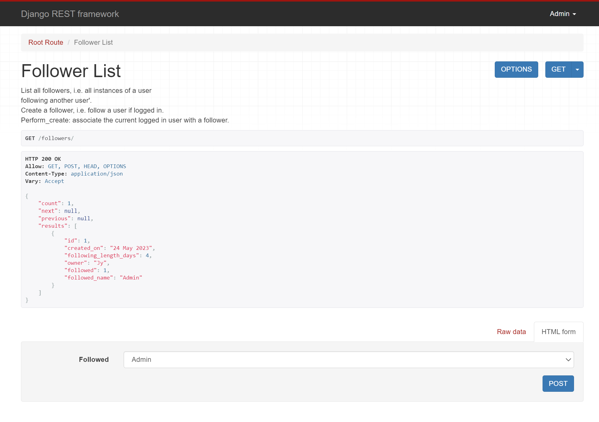
     

    

Screenshot of Follower Detail using it 'id'

    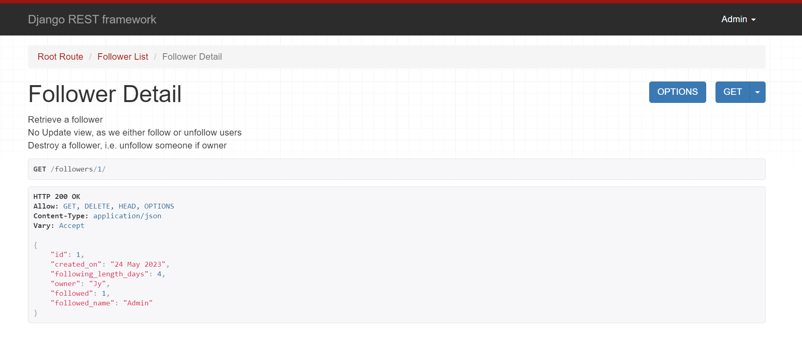
    

    

Screenshot of Permission denied to follow someone twice 

    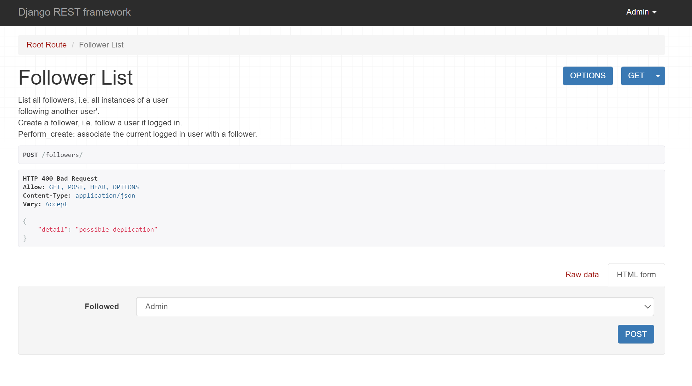
    

5. Post likes:

   - Users are successfully able to like other posts. API successfully registers the post_likes_id to the post.
   - Users are successfully able to unlike the posts that they have liked.
   - Users are not able to like their own posts or else a permission denied error will be thrown.
   - If users try to like a post they have already liked, the API will throw a duplicate validation error.
   - All urls are working perfectly. Can view all post likes when visiting `/post_likes/`. Can access specific post likes in detail view when adding specific post likes id to url.

    

Screenshot of Post Likes List 

     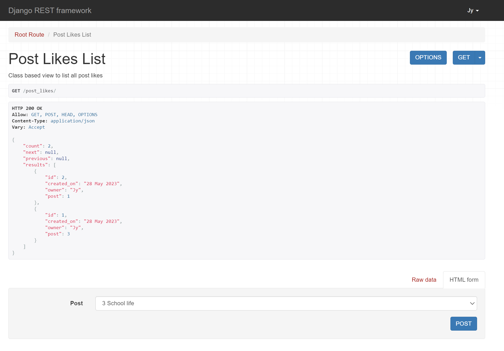
     

    

Screenshot of Post Like Detail using its 'id'

    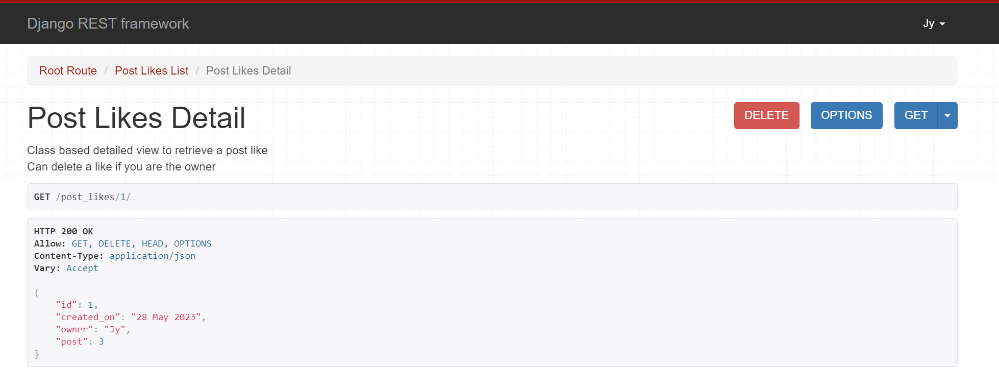
    

    

Screenshot of Permission denied to like own posts 

    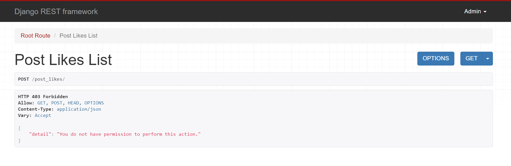
    

    

Screenshot of duplicate post like 

    
    

6. Comment likes:

   - Users are successfully able to like other comments. API successfully registers the comment_likes_id to the comment.
   - Users are successfully able to unlike the comments that they have liked.
   - Users are not able to like their own comments or else a permission denied error will be thrown.
   - If users try to like a comment they have already liked, the API will throw a duplicate validation error.
   - All urls are working perfectly. Can view all comment likes when visiting `/comment_likes/`. Can access specific comment likes in detail view when adding specific comment_likes_id to url.

    

Screenshot of Comment Likes List 

     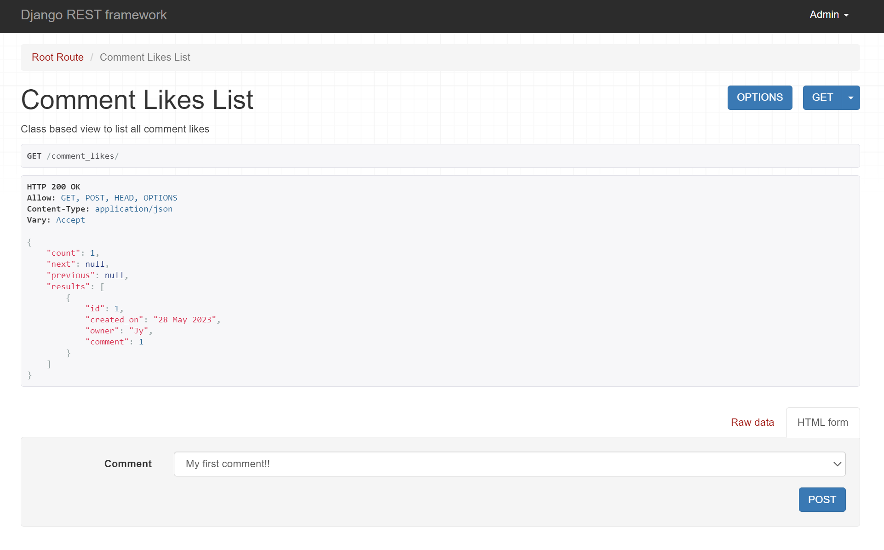
     

    

Screenshot of Permission denied to comment own posts 

    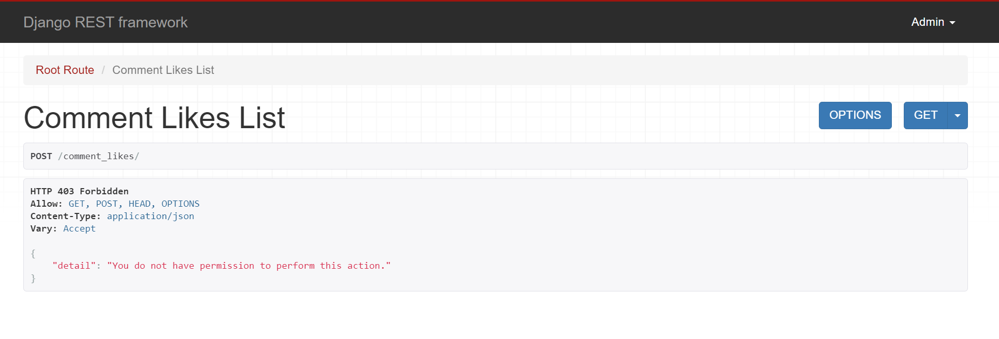
    

    

Screenshot of duplicate comment like 

    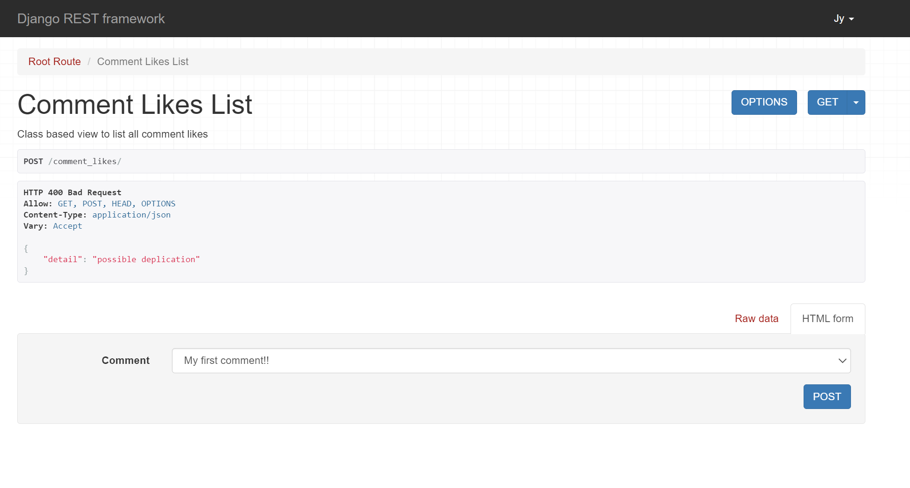
    

7. Error Handling:

   - When a 404 error is thrown (the user accesses a page that does not exist), the custom error handle message will show.
   - When a 500 error is thrown (the back end or server is having an issue), the custom error handle message will show.

8. Authentication:
   - Users are able to create a new account on the back end and the new user details will be saved.
   - In the back end, users are able to successfully login and view their username in the navigation bar.
   - Users are able to log out of the back end successfully.

### Bugs

During project work I have come across many errors related to FieldError, TypeError, NodeNotFoundError etc. I followed stackoverflow and Slack community to solve them.

- (1) Issue: In the middle of my api project, I was not able to login when visiting `/profiles/` or `/posts/` etc. It showed the error `DoesNotExist at /api-auth/login`.

- Fix: I left it as is. Later I started the deployment for my project and strictly followed all the steps mentioned in the LMS like JWT auth setting, client origin, SQL database setting, added some content in settings.py like coresheaders, dj_rest_auth.registrations, SITE_ID, Middleware and many more. Then after successfully deploying it to Heroku, I was able to login/logout when I tested. So don't know exactly what was the matter.

## Deployment

- The following steps were taken for the deployment process for the back end component of Childhood Memories. These steps take place after Django is correctly installed and an 'env.py' file is made (and file is added to .gitignore). [Cloudinary](https://cloudinary.com/) must also be successfully hooked up to Django by adding in all necessary imports and settings in 'settings.py' and 'env.py'.
  Instructions are copied from CI's DRF Example Project.

1. Login or create an account to [ElephantSQL](https://www.elephantsql.com/) and click "Create New Instance".
2. Set up a plan, give your plan a name (name of project), select the Tiny Turtle (free plan), leave the Tag fields blank, and select your region.
3. Click review, and after ensuring details are correct, click 'Create instance'.
4. Return to ElephantSQL dashboard and click database instance name for this project.
5. In URL section, click the copy icon to copy database URL.
6. Log in to [Heroku](https://www.heroku.com/).
7. Create a new app, add a unique app name (this project is called "Childhood memories") and choose your region, and create app.
8. Open the settings tab of your project, Add a Config Var 'DATABASE_URL' and for the value, copy in the database URL from ElephantSQL (without quotation marks).
9. In terminal of your project, run `pip3 install dj_database_url==0.5.0 psycopg2`.
10. In 'settings.py' file of project, add `import dj_database_url` underneath `import os`.
11. In 'settings.py', update the DATABASES section to the following:
    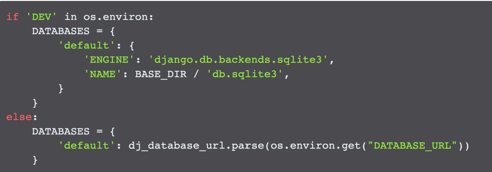
12. In your 'env.py' file, add a new environment variable to Gitpod with the key set to `DATABASE_URL` and the value to your ElephantSQL database URL.
13. Temporarily comment out the DEV environment variable so Gitpod can connect to external database.
14. Back in 'settings.py', add print statement to confirm you are connected do database.
15. In terminal do a dry run to makemigrations to confirm you are connected to the database. If you see the 'connected' message printed in terminal, remove print statement.
16. Migrate your database models running `python3 manage.py migrate`.
17. In terminal of Gitpod workspace, install gunicorn by running `pip3 install gunicorn django-cors-headers`.
18. Update your requirements.txt by running `pip3 freeze --local > requirements.txt`.
19. Create a Procfile by running `touch Procfile`.
20. Inside Procfile, add:
    `release: python manage.py makemigrations && python manage.py migrate`
    `web: gunicorn childhood_memories_drf_api.wsgi`
21. In 'settings.py', update value of ALLOWED_HOSTS variable to include Heroku app's URL.
22. Add corsheaders to INSTALLED_APPS of 'settings.py'.
23. Add corsheaders middlewear to the TOP of MIDDLEWARE.
24. Under MIDDLEWARE list, set the ALLOWED_ORIGINS for network requests to be made to the server with following code:
    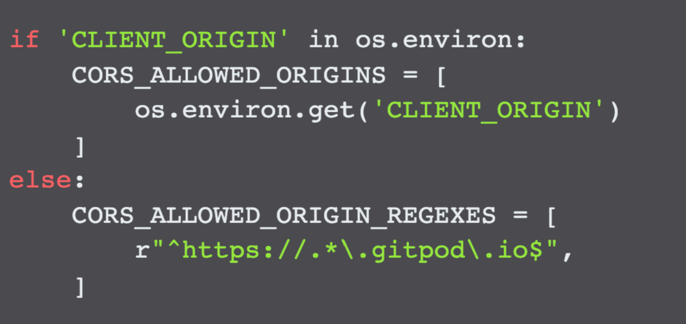

    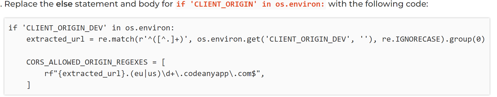

25. To have front-end app and API deployed to different platforms, set JWT_AUTH_SAMESITE atribute to 'None' like so:
    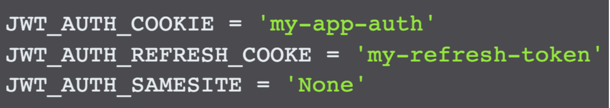
26. Remove the SECRET_KEY value and replace the following code to use an environment variable instead.
27. Set a new value for SECRET_KEY in env.py (do not use the same published to GitHub in commits).
28. Set the DEBUG value to True only if DEV environment variable exists. This will mean it's True in development, and False in production.
29. Comment DEV back in 'env.py'.
30. Ensure 'requirements.txt' file is up to date by running `pip3 freeze --local > requirements.txt`.
31. Add, commit, and push your code to GitHub.
32. Back on Heroku dashboard, open your app and open settings tab.
33. Add two more Config vars, SECRET_KEY (same value as the one in env.py file) and CLOUDINARY_URL (copy in Cloudinary URL from env.py file without quotation marks).
34. Open the Deploy tab.
35. In Deployment method section, select 'Connect to GitHub', search for your repo, and click Connect.

## Credits

### Code

- [Code Institute DRF API Example Project](https://github.com/Code-Institute-Solutions/drf-api)
  This API was built using Django REST Framework. Most of code is inspired by Code Institute's DRF API example project, including the database model, the different features and functionality of the API, creating serializers, setting up the project, setting up filters and search fields, etc. I decided to use the base of whole project on this API since it was a great fit for the application I had planned and it provides a great foundation to expand upon.

- [Django REST Framework Documentation](https://www.django-rest-framework.org/)
  The official Django REST Framework documentation was referred to many times while creating this project.

### Acknowledgement

- Code Institute tutors for help with various issues.
- Stack Overflow for tips, tricks and solutions to fix errors.
